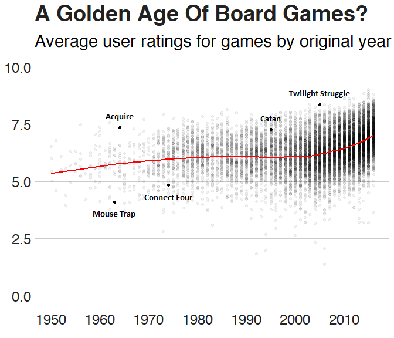
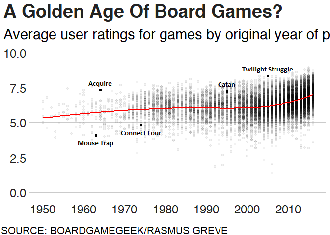
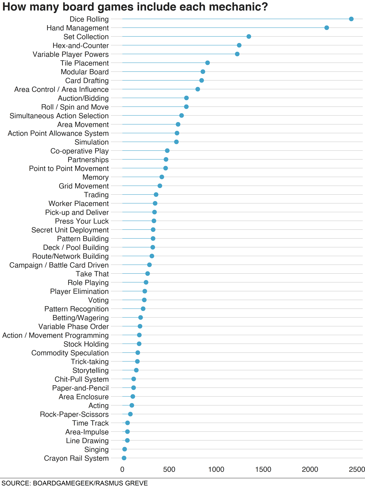
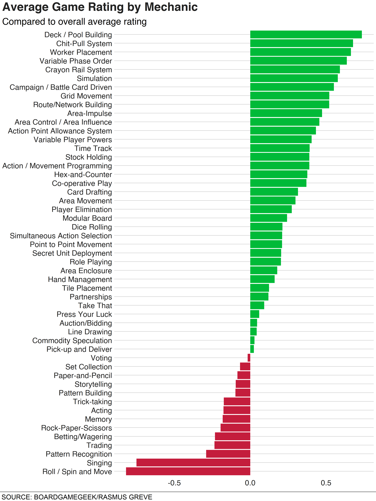
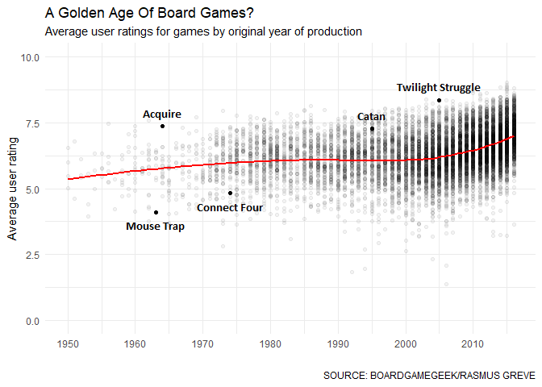
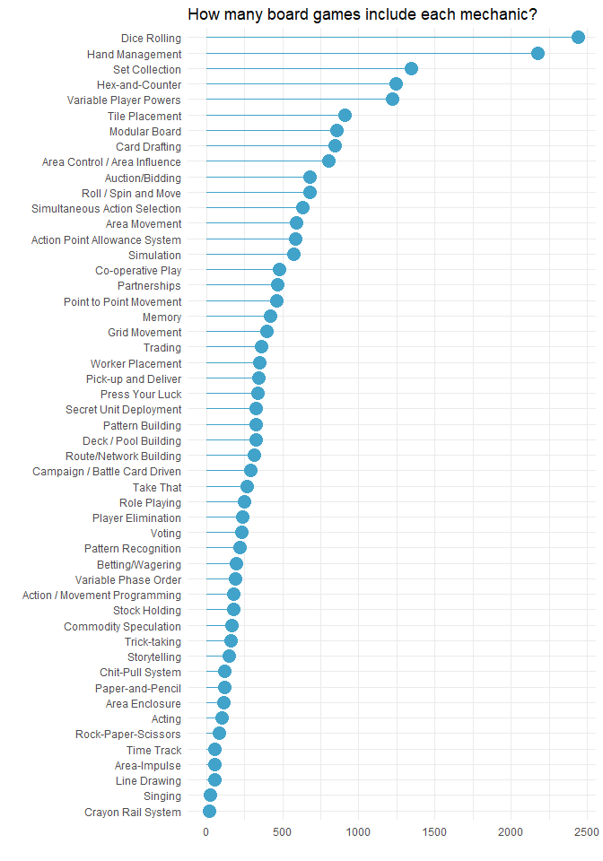
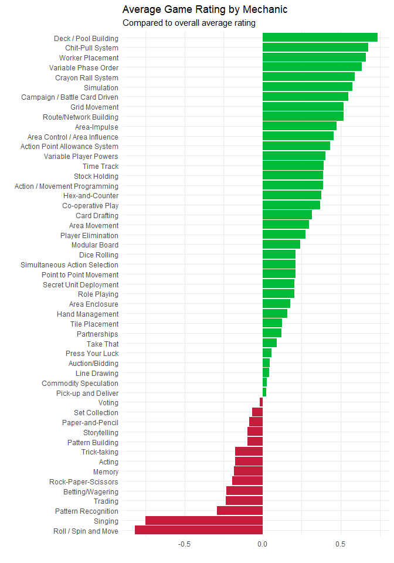

TidyTuesday - Board Games
================
James Stone
2019-03-12

This weeks (2019 Week 11)
[\#TidyTuesday](https://www.twitter.com/search?q=%23TidyTuesday) is
about [Board
Games](https://github.com/rfordatascience/tidytuesday/tree/master/data/2019/2019-03-12)
and I’ve been looking for an excuse to play with the
[bbplot](https://github.com/bbc/bbplot) package ever since the [Medium
article by the
BBC](https://medium.com/bbc-visual-and-data-journalism/how-the-bbc-visual-and-data-journalism-team-works-with-graphics-in-r-ed0b35693535)
outlining their use of ggplot2 was published. So here are a few plots
from this weeks \#TidyTuesday data built using bbplot\!

# Golden age of Board Games?

As a starting point why not recreate the ‘Golden age of Board Games?’
plot from the [fivethirtyeight
article](https://fivethirtyeight.com/features/designing-the-best-board-game-on-the-planet/)
that inspired this \#TidyTuesday selection then use the bbplot package
to add some BBC-inspired flair.

Following the information in the [BBC R
Cookbook](https://bbc.github.io/rcookbook/) we can craft the plot as
normal in ggplot2 and use `bbc_style()` as the final ggplot layer.

A little bit of pre-work before building the plot is just to ensure we
know the exact names of the 5 games that are specifically labelled in
the plot we are
recreating.

``` r
highlight_games = c("Acquire", "Mouse Trap","Connect Four","The Settlers of Catan", "Twilight Struggle")
#ensure the names match
board_games %>% filter(name %in% highlight_games)
```

    ## # A tibble: 4 x 22
    ##   game_id description image max_players max_playtime min_age min_players
    ##     <dbl> <chr>       <chr>       <dbl>        <dbl>   <dbl>       <dbl>
    ## 1       5 In Acquire~ //cf~           6           90      12           3
    ## 2    2679 Mouse Trap~ //cf~           4           30       6           2
    ## 3    2719 Connect 4 ~ //cf~           2           10       6           2
    ## 4   12333 &quot;Now ~ //cf~           2          180      13           2
    ## # ... with 15 more variables: min_playtime <dbl>, name <chr>,
    ## #   playing_time <dbl>, thumbnail <chr>, year_published <dbl>,
    ## #   artist <chr>, category <chr>, compilation <chr>, designer <chr>,
    ## #   expansion <chr>, family <chr>, mechanic <chr>, publisher <chr>,
    ## #   average_rating <dbl>, users_rated <dbl>

Managed to get 4 out of 5 by just trying the name as written in the
plot, Settlers of Catan is the missing piece…

``` r
board_games[grep("[sS]ettlers",board_games$name),]
```

    ## # A tibble: 8 x 22
    ##   game_id description image max_players max_playtime min_age min_players
    ##     <dbl> <chr>       <chr>       <dbl>        <dbl>   <dbl>       <dbl>
    ## 1    3655 Settlers o~ //cf~           4           60       7           2
    ## 2    4394 Based on t~ //cf~           4           90      10           3
    ## 3    6778 The Settle~ //cf~           4           90      12           2
    ## 4   12004 Here's a d~ //cf~           4           60      12           2
    ## 5   38821 In the Set~ //cf~           4           60       0           3
    ## 6   67239 Catan is o~ //cf~           4          120      12           3
    ## 7  152959 This entry~ //cf~           6           75      10           3
    ## 8  154203 Settlers f~ //cf~           4           90      10           1
    ## # ... with 15 more variables: min_playtime <dbl>, name <chr>,
    ## #   playing_time <dbl>, thumbnail <chr>, year_published <dbl>,
    ## #   artist <chr>, category <chr>, compilation <chr>, designer <chr>,
    ## #   expansion <chr>, family <chr>, mechanic <chr>, publisher <chr>,
    ## #   average_rating <dbl>, users_rated <dbl>

I know very little about board games but the fivethirtyeight plot shows
it is mid90s and avg use rating \~ 7.5 and none of these match those
criteria
so…

``` r
filter(board_games[grep("[cC]atan",board_games$name),], year_published %in% 1994:1996 & between(average_rating,7.25,7.75))
```

    ## # A tibble: 1 x 22
    ##   game_id description image max_players max_playtime min_age min_players
    ##     <dbl> <chr>       <chr>       <dbl>        <dbl>   <dbl>       <dbl>
    ## 1      13 In Catan (~ //cf~           4          120      10           3
    ## # ... with 15 more variables: min_playtime <dbl>, name <chr>,
    ## #   playing_time <dbl>, thumbnail <chr>, year_published <dbl>,
    ## #   artist <chr>, category <chr>, compilation <chr>, designer <chr>,
    ## #   expansion <chr>, family <chr>, mechanic <chr>, publisher <chr>,
    ## #   average_rating <dbl>, users_rated <dbl>

Good enough for me, so it’s “Catan”:

``` r
highlight_games[4] = "Catan"
```

Can get on with the plot
now.

``` r
copy538 <- ggplot(data = board_games, aes(x = year_published, y = average_rating)) + 
    geom_point(alpha=0.05) + 
    geom_point(data = board_games %>% filter(name %in% highlight_games)) + 
    geom_smooth(method="loess", se=F, color="red") +
    geom_text_repel(data = board_games %>% filter(name %in% highlight_games[c(1,4,5)]),
        aes(label = name),
        direction="y",
        nudge_y = 0.5,
        point.padding = 0.25,
        segment.color = NA,
        fontface="bold",
        family="Calibri") + 
    geom_text_repel(data = board_games %>% filter(name %in% highlight_games[c(2:3)]),
        aes(label = name),
        direction="y",
        nudge_y = -0.5,
        point.padding = 0.25,
        segment.color = NA,
        fontface="bold",
        family="Calibri") + 
    scale_y_continuous(breaks = seq(0,10,2.5), limits=c(0,10)) + 
    scale_x_continuous(breaks = seq(1950,2010,10)) + 
    labs(x = "", y = "Average user rating",
        title = "A Golden Age Of Board Games?",
        subtitle = "Average user ratings for games by original year of production",
        caption = "SOURCE: BOARDGAMEGEEK/RASMUS GREVE") + 
    bbc_style()
copy538
```

<!-- -->

The `finalise_plot()` is used to make the final style adjustments as
designed by the BBC Data team. I can use the `source_name` argument to
get back the caption that was lost when I added `bbc_style()`.

``` r
finalise_plot(plot_name = copy538, 
    source_name = "SOURCE: BOARDGAMEGEEK/RASMUS GREVE",
    save_filepath = "copy538_bbc.png")
```

<!-- -->

<br /> <br />

# A look at game ‘mechanics’

### Exactly how many are defined in the dataset?

``` r
board_games %>% 
    cSplit("mechanic", direction="long") %>% 
    filter(!is.na(mechanic)) %>% 
    summarise(uniqueMechanics = length(unique(mechanic))) %>% 
    pull()
```

    ## [1] 51

### What are the most/least common mechanics?

``` r
popmechanics <- board_games %>% 
    cSplit("mechanic", direction="long") %>% 
    filter(!is.na(mechanic)) %>% 
    group_by(mechanic) %>% 
    summarise(numGamesWithMechanic = n(),
        avgRating = mean(average_rating)) %>% 
    arrange(desc(numGamesWithMechanic)) %>% 
    mutate(mechanic = factor(mechanic, levels = mechanic[order(numGamesWithMechanic)])) %>% 
    ggplot(aes(x = mechanic, y = numGamesWithMechanic)) + 
    geom_segment(aes(x = mechanic, xend = mechanic, y = 0, yend = numGamesWithMechanic),
        color = "#42a3ca") + 
    geom_point(size = 5, color = "#42a3ca") + 
    labs(
        x = "",
        y = "",
        title = "How many board games include each mechanic?"
    ) + 
    coord_flip() + 
    bbc_style()

finalise_plot(popmechanics,
    source_name = "SOURCE: BOARDGAMEGEEK/RASMUS GREVE",
    save_filepath = "popmechanics.png",
    height_pixels = 1200,
    width_pixels = 900)
```



## Average Rating by Mechanic

``` r
rating_by_mechanic <-  board_games %>% 
    cSplit("mechanic", direction="long") %>% 
    filter(!is.na(mechanic)) %>% 
    group_by(mechanic) %>% 
    summarise(numGamesWithMechanic = n(),
        avgRating = mean(average_rating)) %>% 
    mutate(centeredRating = avgRating - mean(board_games$average_rating, na.rm=T)) %>%
    mutate(quality = ifelse(centeredRating < 0, "below","above")) %>% 
    arrange(centeredRating) %>% 
    mutate(mechanic = factor(mechanic, levels = mechanic[order(centeredRating)])) %>% 
    ggplot(aes(x = mechanic, y = centeredRating)) + 
    geom_bar(stat="identity", aes(fill = quality)) +
    scale_fill_manual(values = c("#00ba38","#c41d3c"), guide=FALSE) +
    labs(x = "",
        y = "",
        title = "Average Game Rating by Mechanic",
        subtitle = "Compared to overall average rating") + 
    coord_flip() + 
    bbc_style()


finalise_plot(rating_by_mechanic,
    source_name = "SOURCE: BOARDGAMEGEEK/RASMUS GREVE",
    save_filepath = "ratingbymechanic.png",
    height_pixels = 1200,
    width_pixels = 900)
```



<br /> <br />

# Compare to theme\_minimal()

As a comparison let’s reproduce the three plots above implementing
`theme_minimal()` as opposed to `bbc_style() + finalise_plot()` as
`theme_minimal()` is the OG.

<!-- -->

<!-- -->

<!-- -->

There is a sharpness to the BBC aesthetic that is rather appealing and
it’s easy to see how they’ve settled on some of the theme choices
they’ve made given how important it is that the data visualisations
they produce are as readable as possible. My default has tended to be to
just add `theme_minimal()` to the end of the majority of my ggplot
graphics and then tinker with anything else that might need editing
theme-wise. The addition of `bbc_style()` to the R universe adds another
most-welcome potential theme for clean and crisp ggplots.
